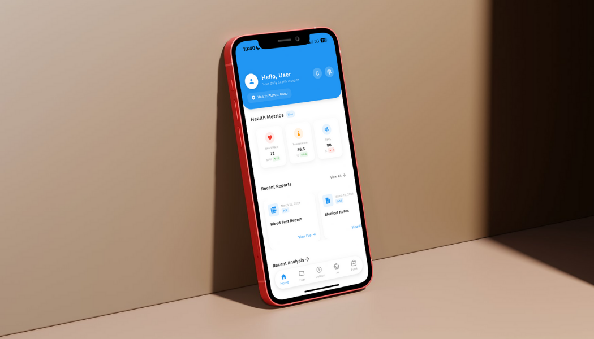
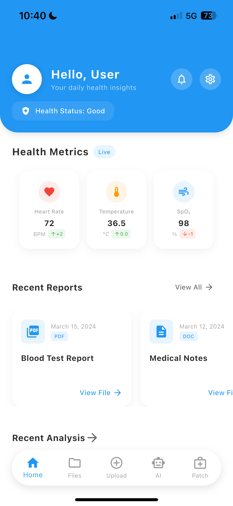
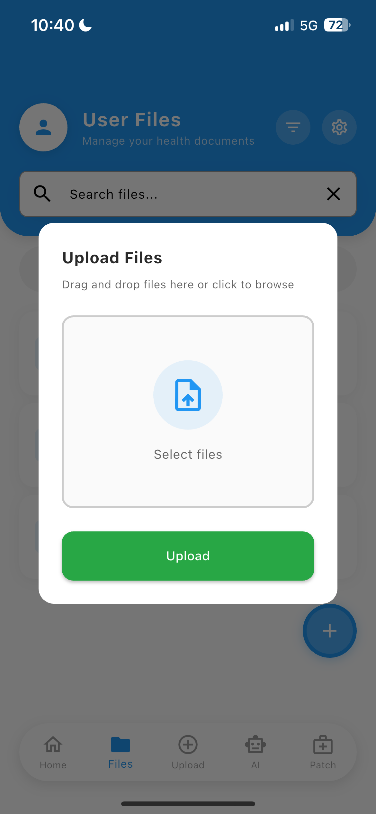

# 🏥 SHMS: Smart Health Monitoring System
> A comprehensive Flutter-based platform for real-time health tracking and patient data management.

[](https://flutter.dev)
[](https://dart.dev)
[](https://firebase.google.com)

---

## 🩺 Project Overview
**SHMS (Smart Health Monitoring System)** was developed to bridge the gap between patients and healthcare providers. By leveraging IoT integration and mobile technology, it provides a seamless way to monitor vital signs and manage medical records on the go.

### **Core Pillars**
* **Monitor:** Track vital signs like heart rate, SpO2, and temperature in real-time.
* **Alert:** Automated emergency triggers and notification systems for critical health thresholds.
* **Manage:** Secure digital vault for prescriptions, lab reports, and medical history.

---

## 📽️ Interface Preview
<div align="center">
  
</div>

| Login | Home | Report | Upload |
| :---: | :---: | :---: | :---: |
|  |  |  |  |

---

## 🛠️ Technical Implementation

* **Front-End:** Developed using **Flutter & Dart** for a cross-platform high-performance experience.
* **Backend & Auth:** Powered by **Firebase** for real-time database synchronization and secure user authentication.
* **State Management:** Built with a clean architecture (MVC/Provider) to ensure scalable and maintainable code.
* **Design Language:** A "Clinical Clean" UI utilizing soothing blues (#2196F3) and high-contrast alert states.

---

## ✨ Key Features

### 📊 Health Analytics
* **Real-time Vitals:** Live streaming of health data from wearable sensors via Bluetooth/Wi-Fi.
* **Historical Trends:** Graphical visualization of health metrics over days, weeks, or months.
* **Smart Diagnosis:** Rule-based logic to categorize health states into *Normal*, *Warning*, or *Critical*.

---

## 📦 How to Run
1.  **Clone the repo:**
    ```bash
    git clone [https://github.com/AlwinJoseph3/shms_fixed.git](https://github.com/AlwinJoseph3/shms_fixed.git)
    ```
2.  **Get dependencies:**
    ```bash
    flutter pub get
    ```
3.  **Run the app:**
    ```bash
    flutter run
    ```

---
## Contacts

[GitHub](https://github.com/AlwinJoseph3) · [LinkedIn](https://www.linkedin.com/in/alwin-joseph-807420221/) 

---
<p align="center">Made with ❤️ for a Healthier Community</p>
